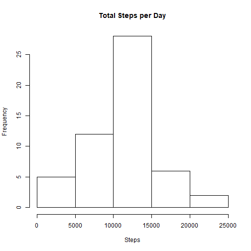
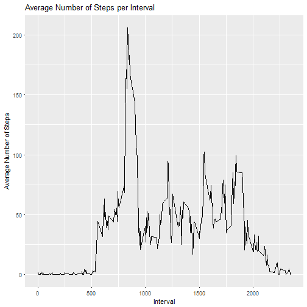
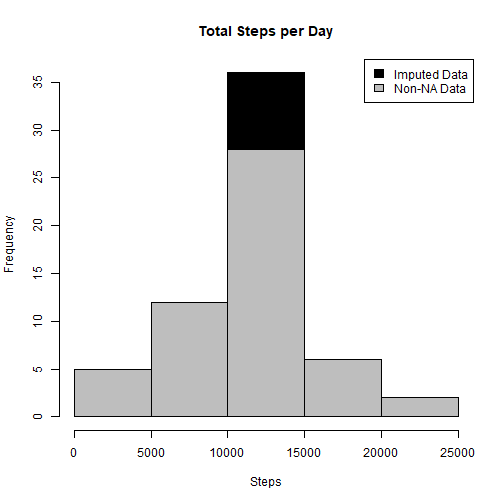
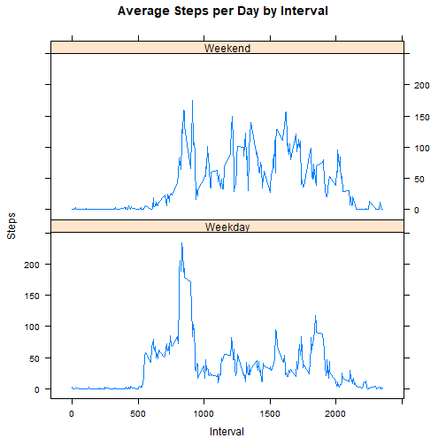

# Reproducible Research: Peer Assessment 1

## Loading and preprocessing the data

#### 1. Load the data by reading the csv file

```r
activity <- read.csv('activity.csv')
```
#### 2. Process/transform the data (if necessary) into a format suitable for your analysis

```r
activity$index = as.numeric(row.names(activity))
activity$date <- as.Date(activity$date, format="%m/%d/%Y")
activity$day <- weekdays(as.Date(activity$date))
clean <- activity[!is.na(activity$steps),]
nadata<- activity[is.na(activity$steps),]
```
## What is mean total number of steps taken per day?

```r
sumTable <- aggregate(activity$steps ~ activity$date, FUN=sum, na.rm=TRUE)
colnames(sumTable)<- c("Date", "steps")
```

#### 1. Make a histogram of the total number of steps taken each day

```r
hist(sumTable$steps, breaks=5, xlab="Steps", main = "Total Steps per Day")
```


#### 2. Calculate and report the mean and median total number of steps taken per day

```r
MeanStepsPerDay <- as.integer(mean(sumTable$steps))
MedianStepsPerDay <- as.integer(median(sumTable$steps))
```

* Mean: 10766
* Median:  10765

## What is the average daily activity pattern?

```r
sumTable2 <- aggregate(clean$steps ~ clean$interval, FUN=mean, )
colnames(sumTable2)<- c("interval", "AvgSteps")
```

##### 1. Make a time series plot of the 5-minute interval (x-axis) and the average number of steps taken, averaged across all days (y-axis)

```r
p <- ggplot(sumTable2, aes(x=interval, y=AvgSteps), xlab = "Interval", ylab="Average Number of Steps")
p + geom_line()+xlab("Interval")+ylab("Average Number of Steps")+ggtitle("Average Number of Steps per Interval")
```



##### 2. Which 5-minute interval, on average across all the days in the dataset, contains the maximum number of steps?

```r
maxSteps <- sumTable2[sumTable2$Avg==max(sumTable2$AvgSteps),1]
```
* Most Steps at: 835

## Imputing missing values
##### 1. Calculate and report the total number of missing values in the dataset 

```r
missingValuesCount <- nrow(activity[is.na(activity$steps),])
```

* Number of missing values: 2304 

##### 2. Devise a strategy for filling in all of the missing values in the dataset. 
##### The strategy used is to calculate the mean number of steps for each interval and use it to populate the missing value of the respective interval for each day

```r
newdata<-merge(nadata, sumTable2, by=c("interval"))
```

##### 3. Create a new dataset that is equal to the original dataset but with the missing data filled in.

```r
newdata2<- newdata[,c(6,3,1,4,5)]
colnames(newdata2)<- c("steps", "date", "interval", "index", "day")
mergeData <- rbind(clean, newdata2)
finalmergeData <- mergeData[order(mergeData$index), ]
finalmergeData1 <- finalmergeData[,c(1,2,3)]
```

##### 4. Make a histogram of the total number of steps taken each day 

```r
sumTable3 <- aggregate(finalmergeData1$steps ~ finalmergeData1$date, FUN=sum)
colnames(sumTable3)<- c("Date", "steps")
hist(sumTable3$steps, breaks=5, xlab="Steps", main = "Total Steps per Day",col="Black")
hist(sumTable$steps, breaks=5, xlab="Steps", main = "Total Steps per Day",col="Grey", add=T)
legend("topright", c("Imputed Data", "Non-NA Data"), fill=c("black", "grey") )
```



##### ... and Calculate and report the mean and median total number of steps taken per day. 


```r
meanImputeddata <- as.integer(mean(sumTable3$steps))
medianImputeddata <- as.integer(median(sumTable3$steps))
```

* Mean (Imputed): 10766
* Median (Imputed):  10766

## Are there differences in activity patterns between weekdays and weekends?
##### 1. Create a new factor variable in the dataset with two levels – “weekday” and “weekend” indicating whether a given date is a weekday or weekend day.


```r
activity$Category <- ifelse(activity$day %in% c("Saturday", "Sunday"), "Weekend", "Weekday")
```

##### 2. Make a panel plot containing a time series plot of the 5-minute interval (x-axis) and the average number of steps taken, averaged across all weekday days or weekend days (y-axis).

```r
stepsByint <- aggregate(steps ~ interval + Category, activity , mean, na.rm=TRUE)
xyplot(stepsByint$steps ~ stepsByint$interval|stepsByint$Category, main="Average Steps per Day by Interval",xlab="Interval", ylab="Steps",layout=c(1,2), type="l")
```



### Activity on weekends appears more compared to weekdays

